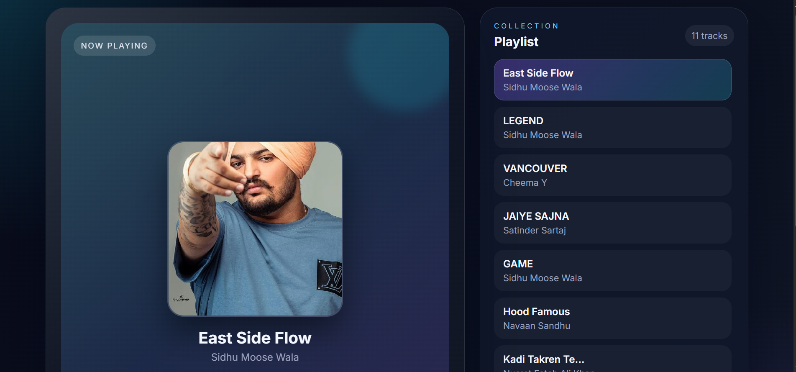

# 🎵 Tunexa Music Player

A modern, responsive, and interactive music player built using **HTML**, **CSS**, and **Vanilla JavaScript**. Tunexa provides a clean user interface with essential music playback controls, playlist management, and a smooth listening experience.

---

## 🚀 Live Demo

🔗 https://shaheerawan295-png.github.io/CodeAlpha_Tunexa_Music_player/

---

## 📸 Preview



---

## ✨ Features

* 🎵 Play and Pause music
* ⏮ Previous & Next track navigation
* 📂 Interactive playlist
* 📀 Dynamic album artwork
* 🎼 Song title and artist information
* ⏱ Real-time progress bar
* 🎚 Seek through any part of a song
* 🔊 Volume control
* 📱 Fully responsive design
* 🎨 Modern glassmorphism-inspired interface

---

## 🛠️ Built With

* HTML5
* CSS3
* JavaScript (ES6)
* HTML5 Audio API
* Font Awesome Icons
* Google Fonts (Inter)

---

## Project Structure

```text
MUSIC PLAYER/
├── assets/
│   ├── images/
│   └── songs/
├── favicon.png
├── index.html
├── README.md
├── screenshot.png
├── script.js
└── style.css
```

---

## ⚙️ Getting Started

### Clone the repository

```bash
git clone https://shaheerawan295-png.github.io/CodeAlpha_Tunexa_Music_player.git
```

### Navigate to the project folder

```bash
cd tunexa-music-player
```

### Run the project

Simply open **index.html** in your preferred web browser.

---

## 💡 Future Improvements

* ❤️ Favorite Songs
* 🔀 Shuffle Mode
* 🔁 Repeat Mode
* 🔍 Song Search
* 🎼 Lyrics Support
* 🌙 Dark / Light Theme
* 💾 Save playlist using Local Storage

---


## 🤝 Contributing

Contributions, suggestions, and improvements are welcome.

1. Fork the repository
2. Create a new branch
3. Commit your changes
4. Open a Pull Request

---

## 📄 License

This project is licensed under the **MIT License**.

---

## 👨‍💻 Author

**Muhammad Shaheer Haider**

GitHub: https://github.com/shaheerawan295-png

---

### ⭐ Support

If you found this project useful, consider giving it a **Star ⭐** on GitHub.
